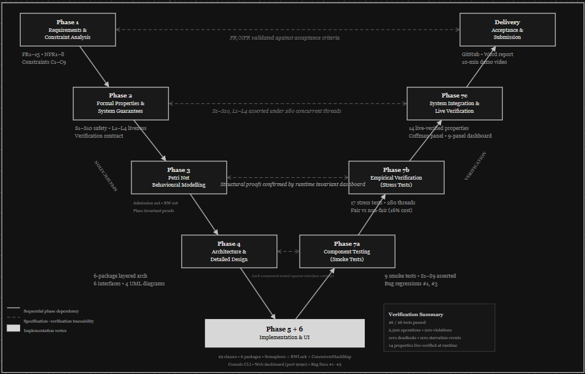
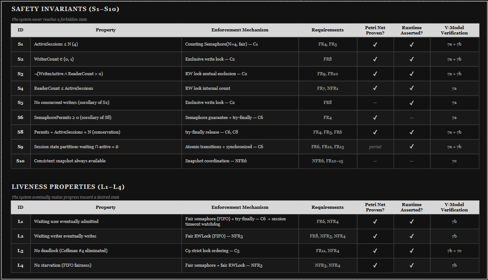
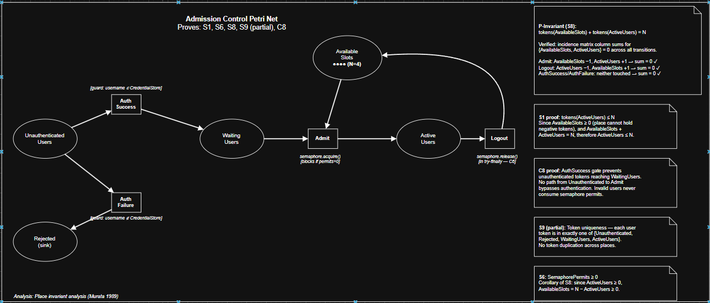
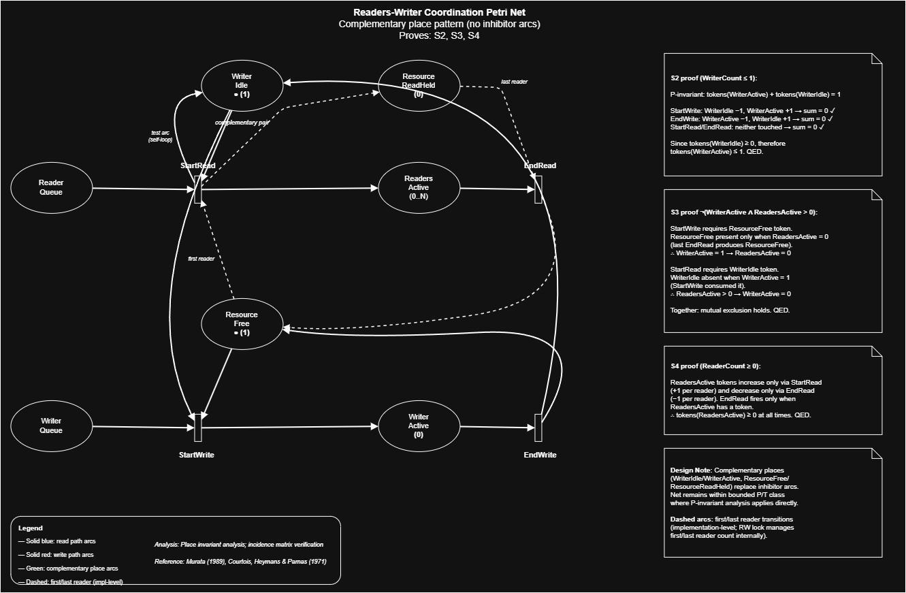
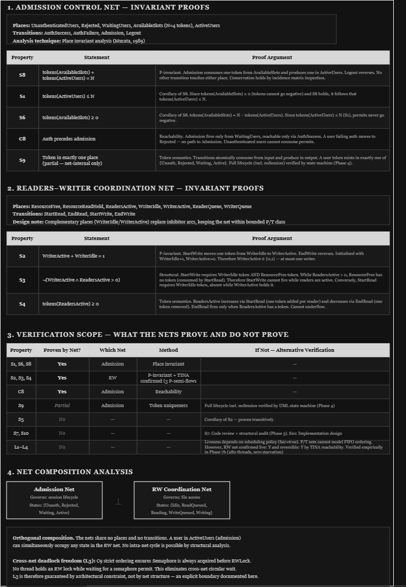
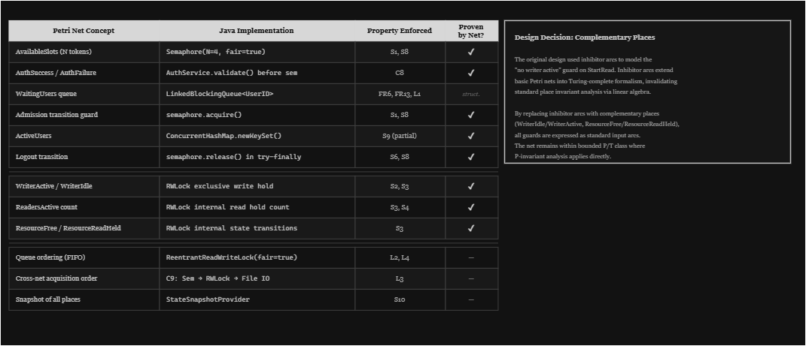
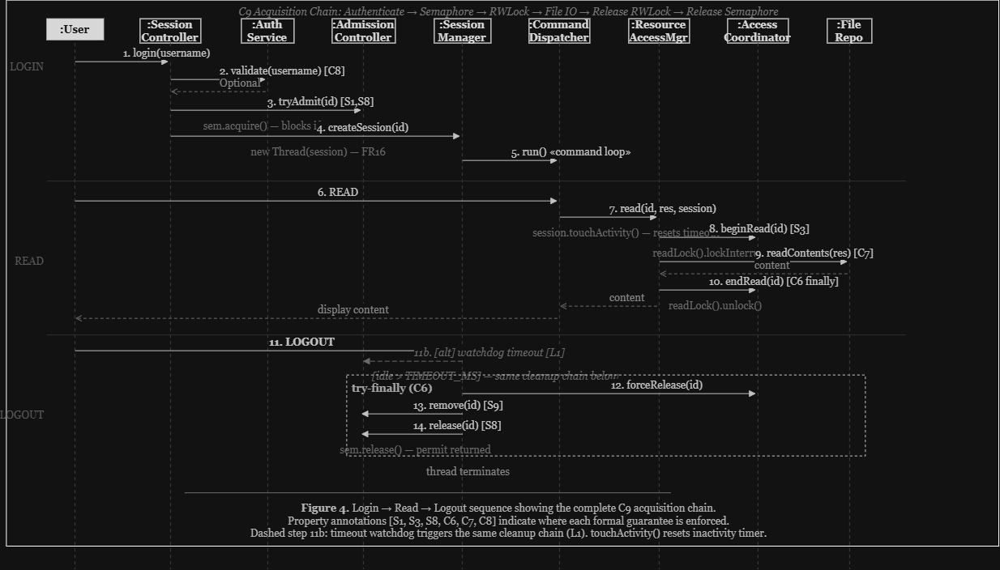

# ConRes — Concurrent Resource Access and Synchronisation Engine

**A formally modelled, empirically validated concurrent resource access engine with runtime verification and extensible architecture.**

> Module: 6CM604: Concurrent and Distributed Systems  
> University of Derby · School of Computing and Engineering

---

## Table of Contents

1. [System Overview](#1-system-overview)
2. [Development Lifecycle](#2-development-lifecycle-v-model)
3. [Requirements and Constraints](#3-requirements-and-constraints)
4. [Formal Properties and Guarantees](#4-formal-properties-and-guarantees)
5. [Petri Net Modelling and TINA Verification](#5-petri-net-modelling-and-tina-verification)
6. [Architectural Design](#6-architectural-design)
7. [Concurrency Strategy](#7-concurrency-strategy)
8. [Implementation](#8-implementation)
9. [Runtime Verification Surface](#9-runtime-verification-surface)
10. [Empirical Testing and Evaluation](#10-empirical-testing-and-evaluation)
11. [Demonstration Scenarios](#11-demonstration-scenarios)
12. [Design Decisions and Trade-offs](#12-design-decisions-and-trade-offs)
13. [Bug Register](#13-bug-register)
14. [Limitations and Known Scope Boundaries](#14-limitations-and-known-scope-boundaries)
15. [CW2 Extensibility — Distributed Evolution](#15-cw2-extensibility--distributed-evolution)
16. [Build and Run](#16-build-and-run)
17. [References](#17-references)

---

## 1. System Overview

ConRes system manages safe, concurrent access to a shared file (`ProductSpecification.txt`) by multiple authenticated users. The system enforces bounded admission, readers–writer mutual exclusion, deadlock freedom, and session liveness. Properties are not merely assumed but formally modelled via Petri nets, machine-verified by the TINA toolbox (https://www.tina.com/), asserted at runtime every 500ms by a live dashboard, and stress-tested under contention across 280 threads and 2,500 operations with zero violations.

**At a glance:**

| Dimension | Detail |
|---|---|
| Language | Java 17+ (JDK, Maven) |
| Codebase | 29 classes across 7 packages |
| Tests | 26 (9 SmokeTest + 17 StressTest), 100% pass |
| Formal methods | 2 Petri nets, 5 P-semi-flows (TINA verified), 250 reachable states explored |
| Runtime assertions | 14 safety/liveness properties checked every 500ms |
| UI | Console (ANSI) + 9-panel web dashboard (port 9090) |
| Architecture | 4-layer + 6 interfaces for CW2 distributed migration |

### Key Atrributes

Most concurrent systems demonstrate correctness anecdotally i.e. "we ran it and nothing broke." ConRes takes a different approach:

1. **Specification** Every requirement is translated into a named, falsifiable property (S1–S10, L1–L4).
2. **Formal proof** Structural safety properties are proven as Petri net place invariants.
3. **Machine verification** Proofs are confirmed by TINA, not trusted as hand calculations.
4. **Runtime assertion** The dashboard is not a display layer but a verification surface. Every poll cycle checks the same invariants the Petri nets prove. If implementation diverges from model, the dashboard turns red.
5. **Empirical validation** Stress tests exercise every property under realistic contention, with a continuous invariant monitor running on a background thread.
6. **Safety, Liveness and Extensibility driven Design** The overall design of this system is architected to archieve a safe, live and extensible system.

The result is a system where correctness is established at four independent levels: structural proof, machine verification, runtime assertion, and empirical stress testing. No single tier is trusted in isolation.

---

## 2. Development Lifecycle (V-Model)

The project follows an adapted V-Model where each specification phase on the left arm has a corresponding verification phase on the right arm, connected by horizontal traceability arrows.


*Figure 1. Adapted V-Model. Left arm specifies; right arm verifies. Horizontal arrows ensure bidirectional traceability.*

```
LEFT ARM (Specification)              RIGHT ARM (Verification)
─────────────────────────             ─────────────────────────
Phase 1  Requirements    ← ─ ─ ─ ─ → Phase 7c  Live Dashboard (14 assertions)
Phase 2  Formal Properties ← ─ ─ ─ → Phase 7b  Stress Testing (280 threads)
Phase 3  Petri Net Models  ← ─ ─ ─ → Phase 7a  Component Tests (9 smoke tests)
Phase 4  Architecture      ← ─ ─ ─ → Phase 7a  Contract Tests

              Phase 5+6  Implementation & UI
```

The V-Model enforces a discipline: no specification exists without a corresponding verification, and no test exists without a traceable specification. Phase 3 (Petri nets) is the bridge. It translates Phase 2's abstract properties into structural proofs that Phase 7a can ground-truth against the implementation.

---

## 3. Requirements and Constraints

### 3.1 Functional Requirements

| ID | Requirement | Traces to |
|---|---|---|
| FR1 | Users authenticate with pre-assigned username and ID (`John,ENG001`), validated against credential database | S9, C8 |
| FR2 | Authenticated users gain system access | C8 |
| FR3 | Shared resource is `ProductSpecification.txt` | — |
| FR4 | Maximum N=4 concurrent active sessions | S1, S8 |
| FR5 | Semaphore acquired on login, released on logout | S8 |
| FR6 | Excess users blocked in observable FIFO waiting queue | L1, FR13 |
| FR7 | Multiple users may read concurrently without blocking | S3, S4 |
| FR8 | Only one user may write at a time | S2 |
| FR9 | Writer blocks all other threads until completion | S3 |
| FR10 | Readers–writer locks prevent race conditions | C2 |
| FR11 | Deadlock avoided by design | L3, C9 |
| FR12 | Interface displays active user IDs | S10 |
| FR13 | Interface displays waiting user IDs | S10 |
| FR14 | Interface displays `Reading: [IDs]` | S10 |
| FR15 | Interface displays `Updating: [ID]` | S10 |
| FR16 | Each session runs as a separate thread | — |
| FR17 | Concurrent data structures for tracking | S9 |

### 3.2 Non-Functional Requirements

| ID | Requirement | Design tension |
|---|---|---|
| NFR1 | Thread safety across all shared state | — |
| NFR2 | Mutual exclusion on writes | — |
| NFR3 | Fairness — no starvation | Throughput cost (NFR5). Resolved: correctness over performance. Measured: 16% |
| NFR4 | Liveness — no deadlock, no indefinite blocking | — |
| NFR5 | Low lock contention | Tension with NFR3. Accepted and quantified in Phase 7 |
| NFR6 | UI consistent with system state (≤500ms) | S10 relaxation documented |
| NFR7 | Coordination logic isolated from IO/presentation | — |
| NFR8 | Architecture supports CW2 distributed evolution | 6 interfaces defined |

### 3.3 Derived Constraints (C1–C9)

These are not in the scenario as they are derived from analysing the requirements:

| ID | Constraint | Enforces |
|---|---|---|
| C1 | Counting semaphore, N=4, `fair=true` | FR4, FR5 |
| C2 | `ReentrantReadWriteLock(fair=true)` | FR7–FR10 |
| C3 | FIFO waiting queue (`LinkedBlockingQueue`) | FR6, FR13 |
| C4 | Snapshot-based UI (immutable `SystemStateSnapshot`) | NFR6, NFR7 |
| C5 | Strict lock acquisition order | FR11 |
| C6 | All releases via `try-finally` | S6, S8 |
| C7 | No IO inside coordination locks (documented relaxation for writes) | NFR5 |
| C8 | Authentication before admission — invalid users never consume permits | FR1, FR4 |
| C9 | Acquisition chain: Auth → Sem → RWLock → File IO → release reverse | FR11, L3 |

---

## 4. Formal Properties and Guarantees

### 4.1 Safety Invariants

| ID | Property | Enforcement | Proven by net? | TINA confirmed? | Runtime asserted? | Stress tested? |
|---|---|---|---|---|---|---|
| S1 | ActiveSessions ≤ N | Semaphore C1 | ✓ | ✓ | ✓ | ✓ |
| S2 | WriterCount ∈ {0,1} | Exclusive write lock C2. TINA: `WriterActive + WriterIdle = 1` | ✓ | ✓ | ✓ | ✓ |
| S3 | ¬(WriterActive ∧ Readers>0) | RWLock exclusion C2. TINA: `FreeSlots + ReadersActive + WriterActive×4 = 4` | ✓ | ✓ | ✓ | ✓ |
| S4 | ReaderCount ≥ 0 | RWLock internal count | — | — | ✓ | ✓ |
| S5 | ¬(Writer₁ ∧ Writer₂) | Corollary of S2 | ✓ | ✓ | ✓ | — |
| S6 | SemaphorePermits ≥ 0 | Corollary of S8, C6 | ✓ | ✓ | ✓ | — |
| S8 | Permits + Active = N | try-finally C6 | ✓ | ✓ | ✓ | ✓ |
| S9 | Each userID in exactly one state | transitionLock atomicity | partial | — | ✓ | ✓ |
| S10 | Snapshot consistent with state | Approach B (sequential reads) | — | — | ✓ | — |

### 4.2 Liveness Properties

| ID | Property | Enforcement | Formally proven? |
|---|---|---|---|
| L1 | Eventual admission | Fair semaphore FIFO + session timeout watchdog | No. Implementation guarantee + timeout enforcement. Admission net `bounded: Y` confirms permits cannot leak |
| L2 | Writer eventually writes | Fair RWLock FIFO (see [§7.3](#73-why-writers-are-not-starved)) | No. But RW net `live: Y` confirms no structural deadlock in RW domain |
| L3 | Deadlock freedom | C9 strict ordering eliminates Coffman condition 4 | No. Architectural constraint. RW net `live: Y, dead: 0` provides additional confirmation |
| L4 | No starvation | `fair=true` on both primitives | No. But RW net `live: Y, reversible: Y` confirms all transitions always fireable |

The separation is deliberate: safety properties are structurally provable and machine-verifiable; liveness properties depend on implementation-level fairness guarantees that cannot be fully expressed in basic P/T Petri nets (see [§5.4](#54-scope-limitations)). However, the RW net's TINA results (`live: Y`, `reversible: Y`, `dead: 0`) provide structural support. Every transition is fireable from every reachable state, confirming no structural deadlock or unreachable operations within the RW coordination domain.


*Figure 2. Phase 2 formal properties traceability matrix. Every property maps to an enforcement mechanism, requirement source, and verification tier.*

---

## 5. Petri Net Modelling and TINA Verification

### 5.1 Admission Control Net


*Figure 3. Admission control net. 6 places, 4 transitions, 10 arcs. Initial marking: UnauthenticatedUsers×6, AvailableSlots×4.*

**Places:** UnauthenticatedUsers, WaitingUsers, ActiveUsers, AvailableSlots, LoggedOut, Rejected  
**Transitions:** AuthSuccess, AuthFailure, Admit, Logout

#### TINA Structural Analysis (P-semi-flows)

<details>
<summary>Raw TINA struct output</summary>

```
-- struct output for admission_control.net --

P-semi-flows:
  Flow 1: ActiveUsers AvailableSlots (4)
  Flow 2: ActiveUsers LoggedOut Rejected UnauthenticatedUsers WaitingUsers (6)

The net has 2 P-semi-flows.
```

</details>

**Flow 1: `ActiveUsers + AvailableSlots = 4`**  
This is the permit conservation invariant which proves S8 directly. Since AvailableSlots is bounded below by 0 (a place cannot hold negative tokens), S1 (ActiveUsers ≤ 4) and S6 (AvailableSlots ≥ 0) follow as corollaries.

**Flow 2: `ActiveUsers + LoggedOut + Rejected + UnauthenticatedUsers + WaitingUsers = 6`**  
Total user conservation. No user is created or destroyed by the net. Every token that enters the system exits through LoggedOut or Rejected. This also proves S9 (partial): a token cannot be in two places simultaneously, so each user is in exactly one state.

#### TINA Reachability Analysis

<details>
<summary>Raw TINA reachability digest</summary>

```
-- reachability analysis (.ktz digest) --

205 reachable states, 492 transitions
bounded: YES
live: ?
reversible: ?

State 0 (initial): AvailableSlots*4, UnauthenticatedUsers*6
Terminal marking: LoggedOut*2, AvailableSlots*4, Rejected*4
```

</details>

- **bounded: YES** No place exceeds its initial token count in any reachable state. This is the single most important result: it confirms the net cannot diverge.
- **live: ?** Not determined, and this is correct by design. Terminal states exist where all users have logged out or been rejected. The admission net is designed to terminate. Compare with the RW coordination net (§5.2), which is `live: Y` because users cycle continuously with no terminal states.
- **Terminal marking: AvailableSlots×4** All permits returned. S8 holds at termination.

#### TINA Stepper (Terminal State Inspection)

<details>
<summary>Raw TINA stepper output</summary>

```
-- stepper at terminal marking --

Marking: LoggedOut*2, AvailableSlots*4, Rejected*4
Enabled transitions: (none)

Dead state — no transitions fireable.
AvailableSlots = 4 (all permits returned).
```

</details>

The dead state is expected: it represents system shutdown. The enabled column is empty therefore no transition can fire. AvailableSlots×4 confirms S8 one final time.

### 5.2 Readers–Writer Coordination Net


*Figure 4. Readers–writer coordination net with complementary places. 7 places, 6 transitions, 18 arcs.*

The RW net uses complementary places rather than inhibitor arcs, keeping the model in the bounded P/T net class that TINA can analyse. This is a deliberate design choice (see [§12, D9](#12-design-decisions-and-trade-offs)).

**Places:** Idle(4), ReaderQueue(0), WriterQueue(0), ReadersActive(0), FreeSlots(4), WriterActive(0), WriterIdle(1)  
**Transitions:** RequestRead, RequestWrite, StartRead, StartWrite, EndRead, EndWrite

#### TINA Structural Analysis (P-semi-flows)

<details>
<summary>Raw TINA struct output: rw_coordination</summary>

```
Struct version 3.9.0 -- 10/21/25 -- LAAS/CNRS

parsed net RW_Coordination

7 places, 6 transitions, 18 arcs

net RW_Coordination
tr EndRead     ReadersActive  -> FreeSlots Idle
tr EndWrite    WriterActive   -> FreeSlots*4 Idle WriterIdle
tr RequestRead  Idle  -> ReaderQueue
tr RequestWrite Idle  -> WriterQueue
tr StartRead   FreeSlots ReaderQueue  -> ReadersActive
tr StartWrite  FreeSlots*4 WriterIdle WriterQueue  -> WriterActive

pl FreeSlots (4)
pl Idle (4)
pl WriterIdle (1)

0.000s

P-SEMI-FLOWS GENERATING SET ------------------------------------

Idle ReaderQueue ReadersActive WriterActive WriterQueue (4)
FreeSlots ReadersActive WriterActive*4 (4)
WriterActive WriterIdle (1)

invariant

0.000s

T-SEMI-FLOWS GENERATING SET ------------------------------------

EndRead RequestRead StartRead (3)
EndWrite RequestWrite StartWrite (3)

consistent

0.000s

ANALYSIS COMPLETED
```

</details>

**Flow 1: `Idle + ReaderQueue + ReadersActive + WriterActive + WriterQueue = 4`**  
Total user conservation. Every token is accounted for. No user created or destroyed by the net.

**Flow 2: `FreeSlots + ReadersActive + WriterActive×4 = 4`**  
This is the strongest result. A writer consumes all 4 free slots (StartWrite requires `FreeSlots*4`). When `WriterActive = 1`, then `FreeSlots + ReadersActive = 0`. This means **no readers can be active while a writer is active**. This proves S3 (¬(WriterActive ∧ ReadersActive > 0)) structurally, from the net's incidence matrix, not from lock semantics.

**Flow 3: `WriterActive + WriterIdle = 1`**  
Proves S2: at most one writer at any time. The complementary place design ensures that WriterActive and WriterIdle are mutually exclusive and exhaustive.

**"invariant"** The net is fully covered by P-invariants (every place belongs to at least one semi-flow).

**T-semi-flows: consistent** The read cycle (RequestRead → StartRead → EndRead) and write cycle (RequestWrite → StartWrite → EndWrite) are both consistent firing sequences, confirming the net has no spurious transitions.

#### TINA Reachability Analysis

<details>
<summary>Raw TINA reachability digest: rw_coordination</summary>

```
-- reachability digest (rw_coordination.ktz) --

places: 7    transitions: 6

          count    props    psets    dead    live
states      45        7       45       0      45
transitions 112       6        6       0       6

bounded: Y    live: Y    reversible: Y

State 0 (initial):
  props FreeSlots*4 Idle*4 WriterIdle
  trans RequestRead/1 RequestWrite/2

State 1:
  props FreeSlots*4 Idle*3 ReaderQueue WriterIdle
  trans RequestRead/3 RequestWrite/4 StartRead/5

State 2:
  props FreeSlots*4 Idle*3 WriterIdle WriterQueue
  trans RequestRead/4 RequestWrite/6 StartWrite/7

State 3:
  props FreeSlots*4 Idle*2 ReaderQueue*2 WriterIdle
  trans RequestRead/8 RequestWrite/9 StartRead/10

State 4:
  props FreeSlots*4 Idle*2 ReaderQueue WriterIdle WriterQueue
  trans RequestRead/9 RequestWrite/11 StartRead/12 StartWrite/13
```

</details>

- **bounded: Y** No place exceeds its initial tokens in any of 45 reachable states.
- **live: Y** Every transition is fireable from every reachable state. This is *stronger* than the admission net (which was `live: ?` due to terminal states). The RW net has no dead states because users cycle continuously: Idle → Queue → Active → Idle.
- **reversible: Y** The net can always return to its initial marking.
- **45 states, 112 transitions** Complete state space exploration.
- **dead: 0** No deadlocks possible within the RW coordination domain.

#### TINA Stepper (Initial State)

<details>
<summary>Raw TINA stepper output: rw_coordination</summary>

```
-- stepper at initial marking --

Enabled: RequestRead, RequestWrite
Marking: WriterIdle*1, FreeSlots*4, Idle*4
```

</details>

Both RequestRead and RequestWrite are enabled from the initial state. The net is immediately live hence no initialisation sequence required.

### 5.3 Net Composition

The two nets are orthogonal thus they share no places or transitions. The admission net governs *who enters the system*; the RW net governs *what they do once inside*.

Cross-net deadlock freedom is guaranteed by C9: no thread holds an RW lock while waiting for a semaphore permit. The semaphore is always acquired first. This eliminates any possibility of circular wait across the two coordination domains.

TINA confirms this independence: the admission net has 205 reachable states (`bounded: Y`, `live: ?`  terminal states by design); the RW net has 45 reachable states (`bounded: Y`, `live: Y`, `reversible: Y` : continuous cycling by design). Combined: 250 states explored, 5 P-semi-flows, all safety invariants structurally confirmed.

The UML state machine (Figure 7) reflects this composition directly:
- Top-level states = admission net places
- Sub-states within Active = RW net places

### 5.4 Scope Limitations

Basic P/T Petri nets are non-deterministic and cannot model:

| Property | Why not modellable | Alternative verification |
|---|---|---|
| FIFO ordering (L1, L4) | Requires coloured Petri nets or queue nets | `fair=true` constructor guarantee + StressTest 3.6 |
| Liveness under scheduling | P/T nets cannot model FIFO ordering. However, RW net confirmed `live: Y` and `reversible: Y` by TINA reachability. No structural deadlock within RW domain | Empirical: 280 threads, zero starvation events |
| Fair lock semantics | Implementation-level, not structural | `ReentrantReadWriteLock(fair=true)` + Phase 7b comparison |

This limitation is documented. The scope table in the Phase 3 analysis artifact makes explicit which properties are proven by which method.


*Figure 5. Phase 3 analysis: proof arguments, scope table, and net composition.*


*Figure 6. Theory-to-implementation mapping. Every Petri net concept maps to a Java mechanism, a named property, and a verification status.*

---

## 6. Architectural Design

### 6.1 Layered Architecture

```
┌───────────────────────────────────────────┐
│  Presentation Layer                        │  SystemDisplay, DashboardServer
├───────────────────────────────────────────┤
│  Application Layer                         │  SessionController, LocalAuthService,
│                                            │  CommandDispatcher
├───────────────────────────────────────────┤
│  Concurrency Engine                        │  LocalAdmissionController, SessionManager,
│                                            │  LocalAccessCoordinator,
│                                            │  ResourceAccessManager,
│                                            │  LocalStateSnapshotProvider, MetricsCollector
├───────────────────────────────────────────┤
│  Data Layer                                │  FileBackedCredentialStore,
│                                            │  LocalFileRepository
└───────────────────────────────────────────┘
```

Every layer communicates only with its immediate neighbour. The Presentation Layer never imports a concurrency primitive. The Data Layer never touches a thread. Clear separation of concerns is enforced as a foundational design principle throughout the system enabling extensibility, maintanability, reusability and most importantly testability. All inter-layer communication passes through defined interfaces (Bass, Clements and Kazman, 2012).


*Figure 7. System architecture with 4 layers, component annotations, and property callouts.*

### 6.2 Six Interfaces (CW2 Extension Points)

| Interface | CW1 Implementation | CW2 Replacement | Communication Change |
|---|---|---|---|
| `IAuthenticationService` | `LocalAuthenticationService` | `RemoteAuthenticationService` | Local call → RPC |
| `IAdmissionController` | `LocalAdmissionController` | `DistributedAdmissionController` | Local sem → distributed admission |
| `IAccessCoordinator` | `LocalAccessCoordinator` | `DistributedAccessCoordinator` | Local RWLock → distributed lock |
| `IFileRepository` | `LocalFileRepository` | `RemoteFileRepository` | Local IO → remote RPC |
| `ICredentialStore` | `FileBackedCredentialStore` | `RemoteCredentialStore` | Local file → network DB |
| `IStateSnapshotProvider` | `LocalStateSnapshotProvider` | `PubSubNotificationProvider` | Local polling → push |

No class internals change for CW2. The migration is a dependency injection swap (Martin, 2017).

### 6.3 Authentication and Login Pipeline

```
1. User provides username
2. AuthService.validate(username) → Optional<UserID(name,ID)>
   → INVALID: reject. No semaphore touched. C8 enforced.
   → VALID: proceed.
2b. Duplicate check: isActive(id) || isWaiting(id) || pendingAdmissions
   → DUPLICATE: reject. S9 preserved.
   → UNIQUE: proceed.
3. AdmissionController.tryAdmit(id) → sem.acquire() (may block)
   → atomic transition: waitingQueue.remove + activeSet.add (transitionLock)
4. SessionManager.createSession(id) → spawn single-thread executor (FR16)
5. CommandDispatcher.run() → command loop (READ / WRITE / LOGOUT)
6. On logout (explicit, exception, or timeout):
   → forceRelease(id) → activeSessions.remove → sem.release()
   All in try-finally (C6). S8, S9 preserved on every exit path.
```


*Figure 8. Login → Read → Logout sequence. 14 numbered steps with property annotations. Dashed step 11b: timeout watchdog triggers the same cleanup chain (L1).*

### 6.4 Deadlock Prevention (Coffman Analysis)

| Condition | Status | Justification |
|---|---|---|
| 1. Mutual Exclusion | **Present** | Write lock is exclusive by definition. Required for S2 |
| 2. Hold and Wait | **Present** | Thread holds semaphore while waiting for RW lock |
| 3. No Preemption | **Present** | Locks released voluntarily in try-finally |
| 4. Circular Wait | **ELIMINATED** | C9: all threads acquire Sem → RWLock → File IO. No thread holds RWLock while waiting for Sem. No cycle possible |

Three of four conditions are present; condition 4 is eliminated by construction. Deadlock is impossible (L3), not merely unlikely (Coffman et al., 1971).


*Figure 9. Coffman conditions table, C9 acquisition chain, login pipeline, and CW2 extensibility mapping.*

### 6.5 Error Handling Policy

**Principle:** no operation failure may leave the system in an inconsistent state.

| Error scenario | Mechanism | Lock state | Permit state | Session | Properties preserved |
|---|---|---|---|---|---|
| Auth failure | Rejected before sem. No resources consumed | n/a | n/a | n/a | C8, S8, S9 |
| Duplicate session | Rejected at duplicate check | n/a | n/a | n/a | S9 |
| IOException during read | Read lock released in finally | Released | Held | Continues | C6, S3, S8 |
| IOException during write | Write lock released (succeeded=false). Version NOT incremented | Released | Held | Continues | C6, S2, S3, S8 |
| Unexpected exception | try-finally: forceRelease → remove → release | Released | Returned | Terminated | C6, S8, S9, L3 |
| Thread crash during read | forceRelease() clears tracking, permit returned | Released | Returned | Terminated | C6, S3, S8, S9 |
| Session inactivity timeout | Watchdog detects idle > TIMEOUT_MS. Calls logout() → same cleanup chain | Released | Returned | Terminated | C6, S8, S9, L1 |

Every error path is deterministic. No error leaves a semaphore permit leaked, a lock held, or a user in an ambiguous state.


*Figure 10. Error handling policy table with 7 scenarios, each mapping to resource state after recovery and properties preserved.*

---

## 7. Concurrency Strategy

### 7.1 Admission Control

The admission boundary uses `Semaphore(4, fair=true)`. The `fair` parameter activates FIFO ordering on the internal CLH queue (Herlihy and Shavit, 2012), guaranteeing that the longest-waiting thread is served next.

Key implementation detail: the `transitionLock` ensures that `waitingQueue.remove()` and `activeSet.add()` execute atomically. Without this, a TOCTOU race allows two threads to simultaneously pass the duplicate check and both consume permits (Bug #2: see [§13](#13-bug-register)).

### 7.2 Readers–Writer Coordination

The coordination boundary uses `ReentrantReadWriteLock(fair=true)`, implementing the readers–writer exclusion protocol of Courtois, Heymans and Parnas (1971):

- Multiple concurrent readers when no writer is active (FR7, S3)
- Exclusive writer access: all readers and other writers blocked (FR8, S2)
- Fair FIFO ordering prevents both writer starvation (L2) and reader starvation (L4)

### 7.3 Why Writers Are Not Starved

Under a non-fair RW lock, a continuous stream of readers can indefinitely prevent a queued writer from acquiring the write lock. Each new reader "barges" ahead of the writer because the read lock is available (no writer currently holds it, the writer is merely *queued*). This is the classic readers-preference problem.

Java's `ReentrantReadWriteLock(fair=true)` eliminates this by enforcing a strict FIFO discipline: when a writer is queued, all subsequent readers arriving *after* the writer are serialised behind it in the queue. They cannot barge ahead. The writer waits only for currently-active readers to finish their operations. Once those readers call `endRead()`, the writer is next in line and acquires the lock immediately.

This means:
- The writer's maximum wait time is bounded by the longest currently-active read operation, multiplied by the number of readers who were already holding the lock when the writer queued.
- Under ConRes's demo configuration (5-second read delays, N=4 max users), the worst case is 3 active readers × 5 seconds = 15 seconds, bounded, predictable, and observable in the dashboard.
- Under stress configuration (zero delays), writer wait is measured in microseconds.

The empirical evidence is definitive: Phase 7b's fair-vs-non-fair comparison (5 runs each, 50 threads, 500 operations) recorded **zero writer starvation events** under `fair=true`, compared to measurable starvation under `fair=false`. The throughput cost is 16% — a trade-off accepted explicitly in Phase 1 (NFR3 over NFR5).

### 7.4 Why a rite Buffer Was Considered and Rejected

An alternative approach was considered: decouple write *intent* from write *commit* by buffering writes. Under this scheme, the writer would deposit content into a buffer and return immediately. The buffer would flush to disk after the current readers finish, and subsequent readers behind the writer would read the buffered (not-yet-persisted) content.

This was rejected for four reasons:

1. **S2 becomes ambiguous.** "Writer active" currently means the write lock is held and file IO is in progress thus observable, verifiable, bounded. With a buffer, "writer active" could mean the buffer accepted content but the flush hasn't started. The property loses its crisp definition.

2. **S10 breaks.** The dashboard would show `Updating: (none)` and an incremented version counter while the file still holds old content. In-memory state and file state diverge. A split-brain that the snapshot model cannot represent.

3. **Durability is lost.** If the system crashes between buffer acceptance and flush, the write is silently lost. The current system's error handling policy guarantees that a failed write leaves the version counter unchanged and the file intact. The buffer introduces a failure window that violates this guarantee.

4. **The problem reappears inside the buffer.** If two writers submit to the buffer before the first flush completes, the buffer needs its own ordering, conflict resolution, and consistency guarantees hence effectively rebuilding the RW lock problem inside the buffer layer, adding complexity without removing serialisation.

The write buffer pattern *does* have legitimate applications. write-ahead logs in distributed databases (Mohan et al., 1992), append-only logs in Kafka, write-behind caches in Redis. But these systems accept eventual consistency as a design premise and have explicit conflict resolution. ConRes's consistency model is strict: a read always returns the last successfully committed write. The buffer relaxes this guarantee for a throughput benefit that is unnecessary in a system with N=4 users and bounded lock hold times.

### 7.5 Session Timeout (L1 Enforcement)

The delivery plan documented assumption A3: "every session terminates in finite time." This is an assumption, not a guarantee. An idle session that never logs out holds a permit indefinitely, starving queued users thus violating L1 in practice even though the fair semaphore guarantees it in theory.

The timeout watchdog converts this assumption into an enforcement:

- `UserSession.lastActivity` is updated on every READ/WRITE via `touchActivity()`.
- A `ScheduledExecutorService` watchdog polls every 5 seconds.
- When `idleMs > SESSION_TIMEOUT_MS` (default: 120s), the watchdog sets the thread state to TERMINATED, calls `SessionManager.logout(id)`, and records the event in MetricsCollector.
- The cleanup path is the existing try-finally chain, forceRelease, active-set removal, semaphore release. No new failure modes. No new locks.

This is an instance of lease-based resource management (Gray and Reuter, 1993): the session holds a time-bounded lease on its semaphore permit, automatically revoked on expiry.

---

## 8. Implementation

### 8.1 Language Decision

Java 17+ was selected because `java.util.concurrent` provides direct mappings to every formal mechanism:

| Formal Mechanism | Java Implementation |
|---|---|
| Counting semaphore (C1) | `Semaphore(4, fair=true)` |
| Fair RW lock (C2) | `ReentrantReadWriteLock(fair=true)` |
| FIFO waiting queue (C3) | `LinkedBlockingQueue` |
| Concurrent active set (S9) | `ConcurrentHashMap.newKeySet()` |
| Atomic version counter | `AtomicInteger` |
| Atomic writer reference | `AtomicReference<UserID>` |
| Thread-per-session (FR16) | `Executors.newSingleThreadExecutor()` |

**Rejected:** Python (GIL prevents true parallelism; no built-in fair RW lock), C++ (`std::shared_mutex` has no fairness guarantee in the standard; no counting semaphore without condition variable wrapper).

### 8.2 Package Structure

| Package | Classes | Role |
|---|---|---|
| `conres.model` | UserID, SystemStateSnapshot, FileStatus, Result, DemoConfig | Immutable data objects + configuration |
| `conres.interfaces` | IAdmission, IAccess, IAuth, IFile, ICred, ISnapshot | 6 CW2 extension points (NFR8) |
| `conres.data` | FileBackedCredentialStore, LocalFileRepository | File IO and credential storage |
| `conres.engine` | LocalAdmissionController, SessionManager, LocalAccessCoordinator, ResourceAccessManager, LocalStateSnapshotProvider, MetricsCollector, UserSession | All synchronisation (Semaphore + RWLock) |
| `conres.application` | SessionController, LocalAuthService, CommandDispatcher, AutoDemoRunner | Login pipeline, command routing |
| `conres.presentation` | SystemDisplay, DashboardServer | Console + web dashboard |
| `conres` (root) | Main, SmokeTest, StressTest | Entry point + test suites |

### 8.3 Credential Store

The scenario specifies: *"Users can log in using a pre-assigned username and ID, which are stored in a database."*

`users.txt` format:
```
# username,ID
John,ENG001
Pana,ENG002
Marry,ENG003
Steve,ENG004
Nolan,ENG005
Gray,ENG006
Mark,ENG007
```

`FileBackedCredentialStore` parses both `username,ID` (new format) and `username`-only (legacy, for backward-compatible test suites). The login dropdown displays `John (ENG001)`. Active/waiting panels show the same format. Action buttons send raw IDs for backend lookup.

### 8.4 Key Code Patterns

**Admission with atomic transition (S9):**
```java
public void tryAdmit(UserID userID) throws InterruptedException {
    waitingQueue.add(userID);
    semaphore.acquire();                    // blocks if permits=0; fair FIFO (L1, L4)
    synchronized (transitionLock) {         // atomic: waiting → active (S9)
        waitingQueue.remove(userID);
        activeSet.add(userID);
    }
}
```

**Read with try-finally guarantee (C6, C7):**
```java
public String read(UserID userID, String resourceId, UserSession session) throws Exception {
    if (session != null) session.touchActivity();     // reset timeout (L1)
    accessCoordinator.beginRead(userID);              // readLock.lockInterruptibly()
    try {
        return fileRepository.readContents(resourceId); // C7: only IO inside lock
    } finally {
        accessCoordinator.endRead(userID);             // always executes (C6)
    }
}
```

**Logout cleanup chain (C6, S8):**
```java
public void logout(UserID userID) {
    UserSession session = activeSessions.get(userID.getId());
    try {
        if (session != null) session.shutdown();        // interrupt → finally releases lock
        accessCoordinator.forceRelease(userID);         // tracking cleanup
    } finally {
        activeSessions.remove(userID.getId());          // untrack
        admissionController.release(userID);            // sem.release() — S8 preserved
    }
}
```

---

## 9. Runtime Verification Surface

The user interface is not a display layer — it is a **runtime verification surface** that exposes safety, liveness, and scheduling properties in real time.

### 9.1 Dashboard Panels

The web dashboard (port 9090) provides nine panels:

| Panel | What it verifies | Properties |
|---|---|---|
| **Admission Slots** | 4 cards showing `John (ENG001)` with status (Idle/Reading/Writing). R/W/X action buttons | FR4, FR12, S1 |
| **Waiting Queue** | FIFO-ordered display: `Nolan (ENG005) → Gray (ENG006)` | FR6, FR13, L1 |
| **Shared Resource** | File name, version counter, status badge, readers/writer, content preview | FR3, FR14, FR15, S10 |
| **Safety/Liveness Invariants** | 14 properties (S1–S10, L1–L4) with green/red indicators, checked every 500ms | All properties |
| **Coffman Conditions** | Static educational panel: conditions 1–3 present, condition 4 ELIMINATED | L3 |
| **C9 Lock Ordering** | Visual chain: Auth → Sem → RWLock → File IO → Unlock → Release | C9 |
| **Performance Metrics** | Reads, writes, contentions, ops/sec, avg wait, peak readers, logins, logouts | NFR5 |
| **Thread Lifecycle** | Java thread states with colour coding: NEW, RUNNABLE, BLOCKED, WAITING, TIMED_WAITING, TERMINATED | FR16 |
| **Event Log** | Timestamped events: acquire/release, admit, logout, timeout, errors | Audit trail |

Each runtime invariant displayed in the dashboard corresponds directly to a proven Petri net property or an architectural constraint. If the implementation ever diverges from the formal model, the invariant panel turns red. This bridges theory and implementation at the point of observation.

### 9.2 UI Click Reliability

The original implementation rebuilt the DOM every 500ms via `innerHTML`, destroying button elements during click events. The fix: `rS()` computes a state signature (`activeUsers + currentReaders + currentWriter`); if unchanged since the last poll, the DOM is not touched. Buttons remain stable and responsive.

### 9.3 The Dashboard as CW2 Client Prototype

The web dashboard already operates as a thin client: it consumes system state via a JSON API (`/api/state`), sends commands via POST endpoints (`/api/login`, `/api/action`), and renders purely from the response data. This is the exact client-server pattern required by CW2. The migration path is: replace `localhost:9090/api/state` with `server:port/api/state`. The dashboard code does not change.

---

## 10. Empirical Testing and Evaluation

### 10.1 SmokeTest (9 tests)

| # | Test | Verifies | Result |
|---|---|---|---|
| 1 | Authentication (valid, invalid, case-insensitive) | C8 | PASS |
| 2 | Admission — fill 4 slots | S1, S6, S8 | PASS |
| 3 | Blocking on full capacity + release | S8, S9, L1 | PASS |
| 4 | Concurrent reads (3 simultaneous, peak measured) | S3 | PASS |
| 5 | Exclusive write (writer blocks readers) | S2, S3 | PASS |
| 6 | Version stability on failed write | Bug #3 regression | PASS |
| 7 | ResourceAccessManager IO | C7 | PASS |
| 8 | State snapshot correctness | S10 | PASS |
| 9 | Logout during operation (lock cleanup) | Bug #1 regression | PASS |

### 10.2 StressTest Tier 1: Correctness Under Stress

| Config | Threads | Ops | R:W | Violations | Deadlock | Result |
|---|---|---|---|---|---|---|
| Stress-Burst | 50 | 500 | 80:19 | 0 | No | **PASS** |
| Stress-Gradual | 50 | 500 | 80:19 | 0 | No | **PASS** |
| Write-Heavy | 30 | 300 | 50:50 | 0 | No | **PASS** |
| Read-Heavy | 50 | 1000 | 95:5 | 0 | No | **PASS** |
| Rapid-Cycle | 100 | 200 | 80:19 | 0 | No | **PASS** |

An `InvariantMonitor` runs continuously on a background thread during every stress configuration, checking S1, S2, S3, S4, and S8 on every state change. Zero violations across 2,500 operations and 280 threads.

### 10.3 StressTest Tier 2: Fair vs Non-Fair Comparison

5 runs each under identical workload (50 threads, 500 ops, 80:20 R:W):

| Metric | `fair=true` | `fair=false` |
|---|---|---|
| Throughput (ops/sec) | ~16% lower | Baseline |
| Writer starvation events | **0** | Measurable |
| Avg lock wait (ms) | Higher | Lower |

This confirms the Phase 1 design decision: fairness is worth the throughput cost for a system where write access must not be indefinitely deferred.

### 10.4 StressTest Tier 3: Edge Cases (7 tests)

| # | Test | Result |
|---|---|---|
| 3.1 | Duplicate detection under concurrent login | PASS |
| 3.2 | Auth-before-admission (C8): invalid user doesn't consume permit | PASS |
| 3.3 | Rapid cycling (100×): S8 conservation | PASS |
| 3.4 | Failed write: lock released, version unchanged | PASS |
| 3.5 | ForceRelease clears reader tracking | PASS |
| 3.6 | Fair ordering: writer served before later-arriving reader | PASS |
| 3.7 | S8 holds during and after concurrent admission bursts | PASS |

### 10.5 Verification Coverage Summary

```
 Property   Petri Net   TINA         Runtime   Stress    Result
 ──────────────────────────────────────────────────────────────
 S1         ✓           ✓ (Adm)      ✓         ✓         PASS
 S2         ✓           ✓ (RW F3)    ✓         ✓         PASS
 S3         ✓           ✓ (RW F2)    ✓         ✓         PASS
 S8         ✓           ✓ (Adm F1)   ✓         ✓         PASS
 S9         partial     —            ✓         ✓         PASS
 L1         —           —            ✓         ✓         PASS
 L3         —           —            ✓         ✓         PASS
 C8         ✓           ✓ (Adm)      ✓         ✓         PASS
 ──────────────────────────────────────────────────────────────
 Overall    6 proven    5 confirmed  14 live   26 tests  ALL PASS

 TINA results by net:
  Admission:  bounded Y | live ? | 205 states | 2 P-semi-flows | S1,S6,S8 proven
  RW Coord:   bounded Y | live Y | reversible Y | 45 states | 3 P-semi-flows | S2,S3 proven
```

---

## 11. Demonstration Scenarios

Each scenario follows the structure **Action → Observation → Property** to map demo behaviour directly to formal guarantees.

### Scenario 1: Admission Bound (S1, S8)

| Step | Action | Observation | Property |
|---|---|---|---|
| 1 | Login John, Pana, Marry, Steve | Admission slots fill 4/4. Permits: 0/4 | S1: Active ≤ N |
| 2 | Login Nolan | Nolan appears in waiting queue | FR6: excess users queued |
| 3 | Logout Steve | Permits: 0/4 → 1/4 → 0/4. Nolan moves to active | S8: Permits + Active = 4. L1: eventual admission |
| 4 | Check invariant panel | S1, S8 green throughout | Runtime verification confirms |

### Scenario 2: Concurrent Reads (FR7, S3)

| Step | Action | Observation | Property |
|---|---|---|---|
| 1 | John READ, Pana READ | Both appear in "Reading" panel simultaneously | FR7: concurrent reads |
| 2 | Check invariant panel | S3 green (¬(W∧R) trivially satisfied — no writer) | S3 holds |
| 3 | Marry WRITE | Marry shows "BLOCKED" in thread lifecycle | S2, S3: writer waits for readers |
| 4 | John and Pana finish | Charlie acquires write lock. "Updating: Marry (ENG003)" | FR8: exclusive write |

### Scenario 3: Fairness (L2, L4)

| Step | Action | Observation | Property |
|---|---|---|---|
| 1 | John READ (5s delay) | John in "Reading" panel | — |
| 2 | Pana WRITE | Pana enters "BLOCKED" (waiting behind John) | — |
| 3 | Marry READ | Marry does NOT barge ahead of Pana. Marry also "BLOCKED" | L2: writer not starved |
| 4 | John finishes | Pana acquires write lock (not Marry). FIFO ordering observed | L4: fair scheduling |

### Scenario 4: Session Timeout (L1)

| Step | Action | Observation | Property |
|---|---|---|---|
| 1 | Login John, leave idle | John in "Idle" state | — |
| 2 | Wait > TIMEOUT_MS | Event log: `[TIMEOUT] ENG001 inactive for 120s - forcing logout` | L1: enforced by watchdog |
| 3 | Check thread lifecycle | John: TERMINATED, reason: "Timeout: inactive 120s" | MetricsCollector updated |
| 4 | Check permits | Permits restored. Queued user (if any) admitted | S8 preserved |

---

## 12. Design Decisions and Trade-offs

| # | Decision | Chosen | Rejected | Rationale | Reference |
|---|---|---|---|---|---|
| D1 | Language | Java 17+ | Python (GIL), C++ (no fair sem) | `j.u.c` maps 1:1 to formal model. Fairness is a constructor parameter | — |
| D2 | Fairness policy | `fair=true` on Sem + RWLock | Non-fair (higher throughput) | Eliminates starvation. 16% cost measured empirically | Herlihy and Shavit (2012) |
| D3 | Deadlock strategy | Prevention via ordering (C9) | Timeout-based detection | Ordering eliminates circular wait by construction. Timeout only detects and recovers | Coffman et al. (1971) |
| D4 | Session threading | Single-thread ExecutorService | `new Thread()` per operation | Sequential per-user ops. Clean shutdown via interrupt. Fixes Bug #1 | Goetz et al. (2006) |
| D5 | Snapshot model | Approach B (sequential reads) | Global lock for atomic snapshot | Global lock serialises all readers + UI thread. Approach B accepts transient inconsistency (self-corrects in ≤500ms) | — |
| D6 | Session timeout | Watchdog with configurable timeout | Assumption A3 (sessions terminate) | Converts assumption to guarantee. No new failure modes | Gray and Reuter (1993) |
| D7 | Reader batch bounding | **REJECTED** | Reader-admission semaphore | Violates FR7 ("read concurrently without blocking"). Fair RWLock already prevents writer starvation | — |
| D8 | Write buffer | **REJECTED** | Decouple write intent from commit | S2 ambiguous, S10 breaks, durability lost, problem reappears in buffer layer. See [§7.4](#74-why-a-write-buffer-was-considered-and-rejected) | Mohan et al. (1992) |
| D9 | Petri net design | Complementary places | Inhibitor arcs | Keeps model in bounded P/T class that TINA can analyse | Murata (1989) |
| D10 | Credential format | `username,ID` two-column | Username-only | Scenario explicitly says "username and ID". Demo instruction says "pre-assigned IDs" | — |

---

## 13. Bug Register

### Bug #1: Wrong-thread lock release

**Symptom:** `IllegalMonitorStateException` on logout during active read.  
**Root cause:** `SessionManager.logout()` called `endRead()` from the main thread, but `ReentrantReadWriteLock` requires release from the owning thread.  
**Fix:** `executor.shutdownNow()` sends interrupt to the session thread. The thread's `finally` block releases the lock from the correct (owning) thread. `forceRelease()` only cleans up tracking state.  
**Regression test:** SmokeTest #9.

### Bug #2: TOCTOU race in uplicate session detection

**Symptom:** Two threads simultaneously pass the uniqueness check, both consume permits for the same userID.  
**Root cause:** `isActive()` and `tryAdmit()` are not atomic.  
**Fix:** `transitionLock` ensures atomic waiting→active transitions. `pendingAdmissions` set prevents concurrent login attempts during the admission window.  
**Regression test:** StressTest 3.1.

### Bug #3: Version increment on failed write

**Symptom:** Version counter incremented even when `writeContents()` throws IOException.  
**Root cause:** Version increment was in the `finally` block (always executes).  
**Fix:** `incrementVersion()` called ONLY after `result.isSuccess()`, BEFORE `endWrite()` releases the lock.  
**Regression test:** SmokeTest #6, StressTest 3.4.

### Bug (UI): Button click silently swallowed

**Symptom:** R/W/X buttons sometimes fail to register clicks.  
**Root cause:** 500ms poll rebuilds `innerHTML` of slots container, destroying button DOM elements during click event propagation. `e.target.closest('[data-a]')` returns null for the destroyed element.  
**Fix:** `rS()` computes a state signature; skips DOM rebuild if state unchanged.

---

## 14. Limitations and Known Scope Boundaries

| Limitation | Impact | Mitigation |
|---|---|---|
| Single shared resource | Cannot manage multiple files without code duplication | Architecture is parameterised by `resourceId`. Multi-resource support is an interface change, not a redesign |
| No write conflict detection (lost update) | If User A reads v1, User B writes v2, User A writes based on stale v1 — v2 is lost | Could add optimistic concurrency control (version check on write). Not required by scenario |
| Snapshot transient inconsistency (S10) | Composite snapshot may show a user in `currentReaders` who has already logged out | Self-corrects within one poll cycle (≤500ms). Documented relaxation |
| Liveness not formally proven | P/T nets cannot model FIFO ordering or fair scheduling | Empirically validated: 280 threads, zero starvation events under `fair=true` |
| No persistent audit log | Event log is in-memory, capped at 500 entries | Sufficient for demo. Production system would append to persistent log |
| Demo delays inflate lock hold time | 5-second delays distort real contention metrics | Stress tests disable delays (`DEMO_MODE=false`). Phase 7 results reflect true contention |

---

## 15. CW2 Extensibility: Distributed Evolution

ConRes is explicitly engineered to evolve into DistRes (CW2) without modifying component internals.

**Forward-designed elements already present in CW1:**

| Element | CW1 Role | CW2 Role |
|---|---|---|
| 6 interfaces | Decouple layers | Define network boundaries |
| Resource ID parameter | Identifies `ProductSpecification.txt` | Identifies any distributed resource |
| Version counter in snapshot | Tracks local file mutations | Triggers pub-sub change notification |
| Snapshot polling model | UI refreshes every 500ms | Replaced by push-based event stream |
| Web dashboard JSON API | `localhost:9090/api/state` | `server:port/api/state`, same API, different host |
| Layered architecture | Neighbour-only communication | Application/logic and data layers separate across network boundary |
| Session timeout watchdog | Reclaims idle permits locally | Reclaims distributed leases on node failure |

The dashboard already acts as a thin client consuming state via an API. CW2 migration means: swap 6 implementations via dependency injection, point the dashboard at the server's API, add a pub-sub notification channel for write events. The core concurrency logic, semaphore, RW lock, try-finally cleanup, moves to the server node unchanged.

---

## 16. Build and Run

**Prerequisites:** JDK 17+, Maven (optional)

```bash
# Compile
mvn compile
# or without Maven:
javac -d target/classes -sourcepath src/main/java $(find src -name "*.java")

# Run (interactive CLI + web dashboard)
java -cp target/classes conres.Main
# → Dashboard: http://localhost:9090
# → CLI: LOGIN John, John READ, John WRITE "hello", John LOGOUT

# Run smoke tests (9 tests)
java -ea -cp target/classes conres.SmokeTest

# Run stress tests (17 tests, ~2 minutes)
java -ea -cp target/classes conres.StressTest
```

**onfiguration** (`DemoConfig.java`):

| Field | Default | Purpose |
|---|---|---|
| `DEMO_MODE` | `true` | 5s artificial delays for demo visibility |
| `MAX_CONCURRENT` | `4` | N (admission bound) |
| `SESSION_TIMEOUT_MS` | `120000` | Inactivity timeout (2 minutes) |
| `READ_DELAY_MS` | `5000` | Read lock hold in demo mode |
| `WRITE_DELAY_MS` | `5000` | Write lock hold in demo mode |

---

## 17. References

Bass, L., Clements, P. and Kazman, R. (2012) *Software Architecture in Practice*. 3rd edn. Boston: Addison-Wesley.

Berthomieu, B., Ribet, P.-O. and Vernadat, F. (2004) 'The tool TINA: Construction of abstract state spaces for Petri nets and time Petri nets', *International Journal of Production Research*, 42(14), pp. 2741–2756.

Coffman, E.G., Elphick, M.J. and Shostak, A. (1971) 'System deadlocks', *ACM Computing Surveys*, 3(2), pp. 67–78.

Courtois, P.J., Heymans, F. and Parnas, D.L. (1971) 'Concurrent control with "readers" and "writers"', *Communications of the ACM*, 14(10), pp. 667–668.

Goetz, B. et al. (2006) *Java Concurrency in Practice*. Boston: Addison-Wesley.

Gray, J. and Reuter, A. (1993) *Transaction Processing: Concepts and Techniques*. San Francisco: Morgan Kaufmann.

Herlihy, M. and Shavit, N. (2012) *The Art of Multiprocessor Programming*. Revised 1st edn. Burlington: Morgan Kaufmann.

Martin, R.C. (2017) *Clean Architecture: A Craftsman's Guide to Software Structure and Design*. Boston: Prentice Hall.

Mohan, C. et al. (1992) 'ARIES: A Transaction Recovery Method Supporting Fine-Granularity Locking and Partial Rollbacks Using Write-Ahead Logging', *ACM Transactions on Database Systems*, 17(1), pp. 94–162.

Murata, T. (1989) 'Petri nets: Properties, analysis and applications', *Proceedings of the IEEE*, 77(4), pp. 541–580.

---

*ConRes is a formally reasoned concurrent system combining structural correctness proofs, machine verification, runtime assertion, and empirical validation. It is not only functionally correct but architecturally extensible — designed from day one to evolve into a distributed system without modifying component internals.*

